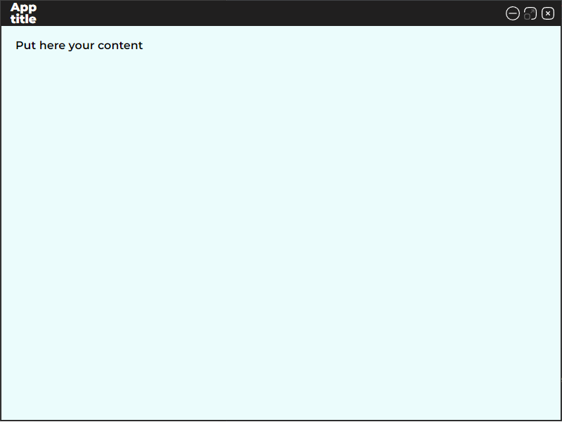

# Electron-React Application Boilerplate

## Description:
Template code project to create Electron.js applications using technologies such as **React.js**, **Typescript**, **Redux-toolkit**, **SCSS** and so on.
The full list of technologies can be seen in the package.json file located in the root of the project.
___
## Representation
A template application is a browser window with a custom frame and control buttons for this window located in the upper right corner of the window. Events from button clicks are transmitted to the main application process and processed by it according to all security requirements described in the documentation of the Electron framework

___
## How to use
To use this template, you must: 
1. Clone the repository of this project to the local machine. 
2. Install the dependencies specified in the **package.json** file. 
3. Launch the application with the **npm start** command